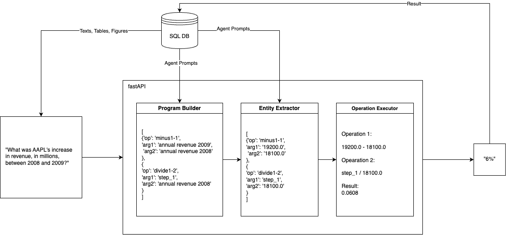
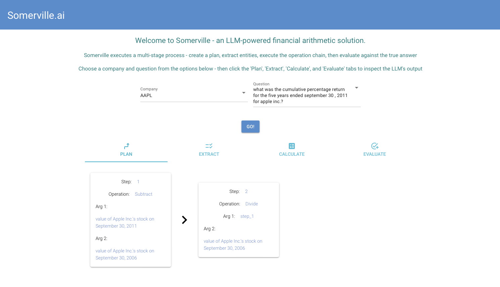
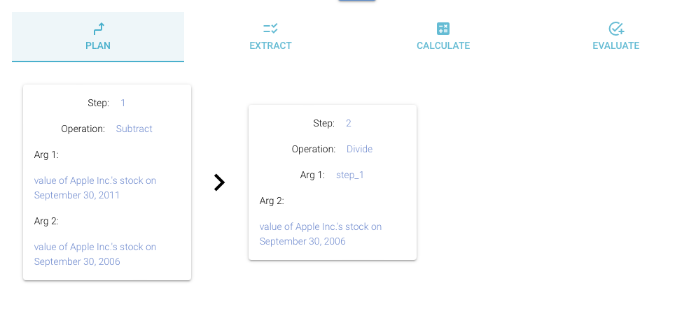
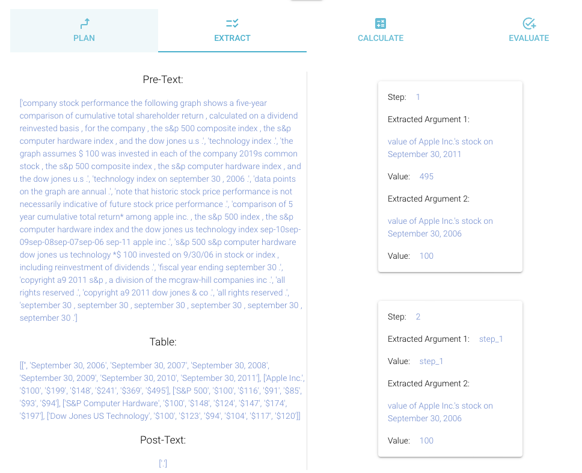
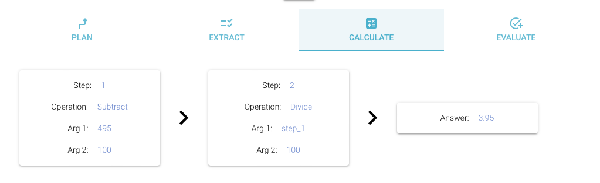
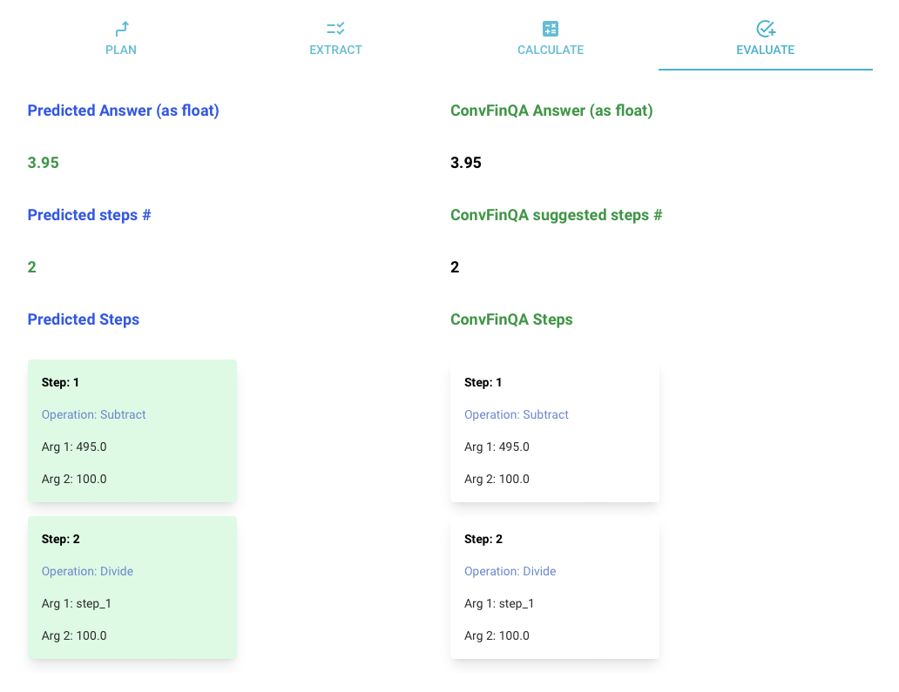

# Somerville  
Welcome to **Somerville**! A solution to the **ConvFinQA** challenge. Named after Mary Somerville, a Scottish mathematician.  

## How Does Somerville Work?

<div style="text-align: center;">  
  
</div>  

Somerville is a simple full stack webapp, creating using:
- A fastAPI backend
- A niceGUI frontend
- A simple relational SQL database
- 2 LLM agents and an operation execution class

## How to Use Somerville  
Somerville is an interactive chain of LLM calls designed to demonstrate how language models can be used to answer mathematical queries.  

Simply start the app, choose your company, choose your question, and explore the LLM's thought process and evaluation of the answer.  

<div style="text-align: center;">  
  
</div>  

After hitting **'Go!'**, check out the plan the LLM has created on the **'Plan'** tab. This shows the LLM's thought process on how to solve the problem and descriptions of the arguments it knows it needs to extract.  

<div style="text-align: center;">  
  
</div>  

Then check out the **'Extract'** tab. Here, you can see the information the LLM has been provided, as well as its choices on what values to extract, based on the descriptions in the plan.  

<div style="text-align: center;">  
  
</div>  

Next, we calculate the answer based on the operation chain and the values extracted by the LLM.  

<div style="text-align: center;">  
  
</div>  

Finally, see the **'Evaluation'** tab. This tab shows a detailed overview of what the LLM planned, extracted, and answered - compared to the true steps taken from the same question in the ConvFinQA dataset.  

<div style="text-align: center;">  
  
</div>  

---

## How to Start Somerville  

### 1. Create a Virtual Environment  
#### On Windows:  
```bash  
python -m venv venv  
```  

#### On Unix/macOS:  
```bash  
source venv/bin/activate  
```  

#### On Windows:  
```bash  
.\venv\Scripts\activate  
```  

Then install dependencies from `requirements.txt`:  

```bash  
pip install -r requirements.txt  
```  

### 2. Add a `.env` File  
For review and testing, it is recommended to set **`USE_DATABASE`** to `'no'`.  

```bash  
OPENAI_API_KEY = <YOUR_API_KEY>  

# If you want to use the data model, please create an empty database called 'somerville'  
DATABASE_URL = "postgresql://<username>:<password>@localhost:5432/somerville"  

# If you want to just use the JSON files in the application, set USE_DATABASE to 'no'  
USE_DATABASE = 'no'  
```  

### 3. Start the Backend  

Navigate to the `/src/` directory:  

```bash  
(.venv) <your_path_to_somerville> cd /src  
```  

Start the FastAPI application:  

```bash  
uvicorn main:app --host 0.0.0.0 --port 80 --reload  
```  

### 4. Start the Frontend  

Execute the following command to start the frontend application:  

```bash  
python src/frontend/main.py  
```  

Alternatively, if the full path is required, use:  

```bash  
/path/to/.venv/bin/python /path/to/repo/src/frontend/main.py  
```

## Directory Structure

**Core Directories:**

1. **`model/`**: Defines the Pydantic models (`QueryRequest`, `QueryResponse`, `EvaluationRequest`, etc.).
2. **`database/`**: Handles database operations including initialization, data storage, and retrieval.
3. **`agents/`**: Manages agent archetypes, initialization utilities, and related configurations.
4. **`utilities/`**:
    - **`PromptTemplates.py`**: Provides message templates for workflows.
    - **`ProcessEvalResults.py`**: Processes evaluation responses and computes a summary.
    - **`AgentWorkflow.py`**: Core logic for executing agent workflows.
    - **`AppStartup.py`**: Streamlines app initialization, database loading, and agent setup.
5. **`logger/`**: Contains methods to configure and use custom loggers within the app.

---

## Environment Variables

- **`DATABASE_URL`**: Specifies the SQL database connection string. Ensure this points to `Someville`.
- **`USE_DATABASE`**:
  - Set to `yes` to use the SQL database for storage.
  - Leave unset or set to `no` to use JSON files as storage.
- **`OPENAI_API_KEY`**: Required to access OpenAI's API for certain workflows.

---

## API Endpoints

### **Root Endpoint**

`GET /`  
Returns a "Hello World" message, confirming the app's availability.

**Response**:
```json
{
  "Hello World"
}
```

---

### **Get Question List**

`GET /get_question_list`  
Fetches the list of questions (metadata) from the database or JSON file.

**Response**:
Returns question metadata in JSON format:
```json
[
  {
    "question_id": 1,
    "question_text": "What is X?",
    ...
  },
  ...
]
```

---

### **Answer Question**

`POST /answer_question`

Processes a question and executes a corresponding workflow.

**Request Body**:
```json
{
  "message": "<question_text>",
  "max_retries": <integer>,
  "status": "<string>"
}
```

**Response**:
```json
{
  "answer": "<response_text>",
  "operations": [...],
  "metadata": {...}
}
```

---

### **Get Evaluation**

`POST /get_evaluation`

Provides an evaluation summary by comparing agent outputs with pre-defined answers.

**Request Body**:
```json
{
  "n_questions": <integer>,
  "max_retries": <integer>
}
```

**Response**:
Returns an evaluation summary:
```json
{
  "success_rate": <float>,
  "average_latency": <float>,
  "details": [...]
}
```

---

## Running Tests

1. Write test cases using Python's `unittest` or `pytest`.
2. Run the tests:

   ```bash
   pytest
   ```

---

## Troubleshooting

- **Error: `OPENAI_API_KEY` is missing**:
   - Ensure that you have added a valid `OPENAI_API_KEY` to your `.env` file.

- **Error: Cannot connect to the database**:
   - Double-check your `DATABASE_URL` in the `.env` file for any typos or missing credentials.
   - Verify that the database server is running and accessible.

---

## To-Dos/Future Improvements

- Add more agent archetypes to handle diverse workflows.
- Implement caching for repeated queries to improve latency.
- Extend support for other database backends like MySQL or SQLite.
- Build a front-end interface to complement the back-end API.

---

## License

This project is open-source and is licensed under the MIT License.

---

## Author

Andrew Finch