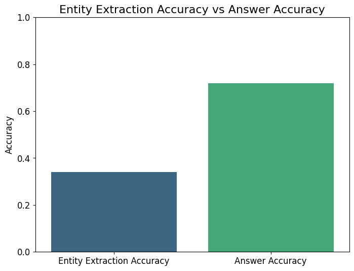
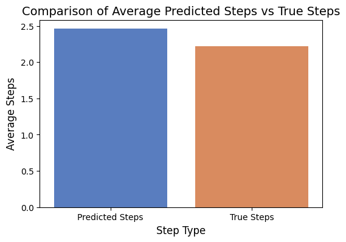
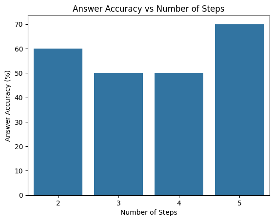
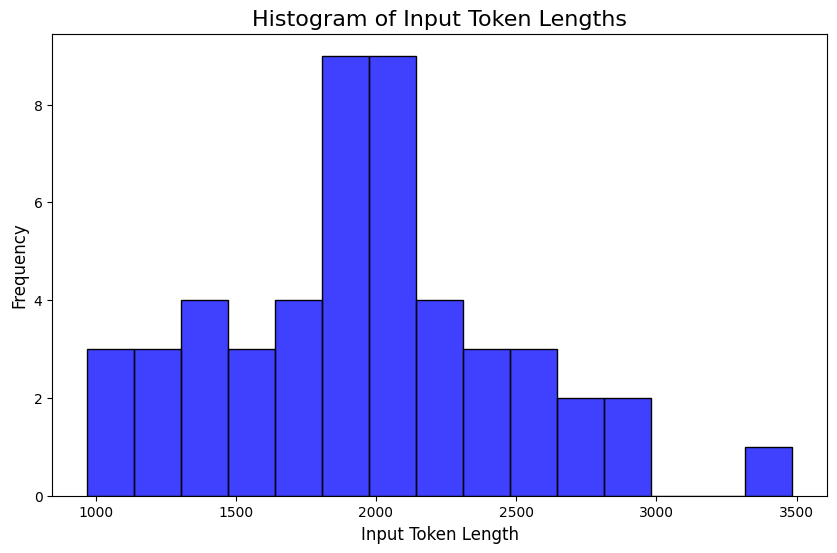
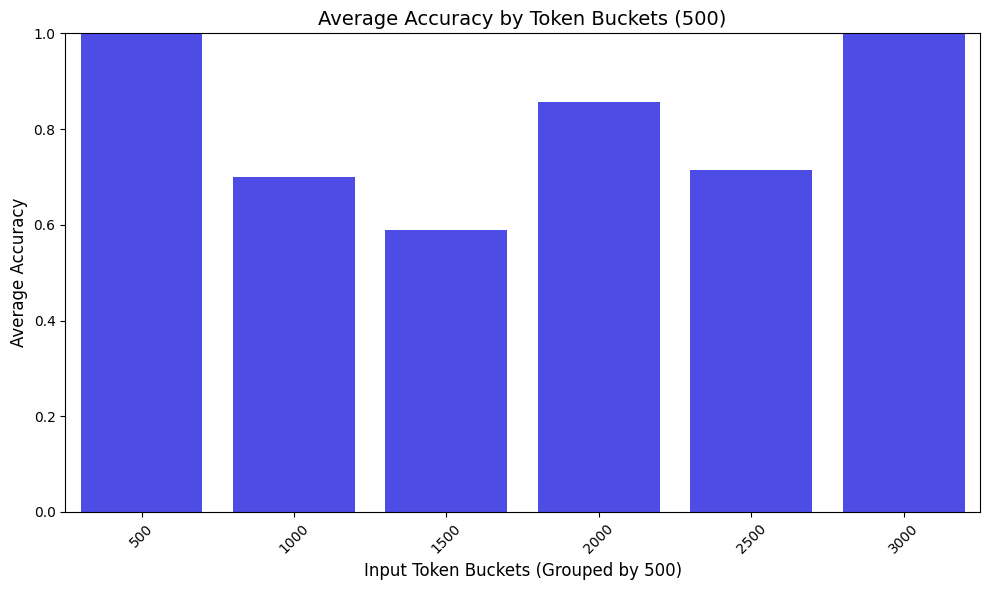
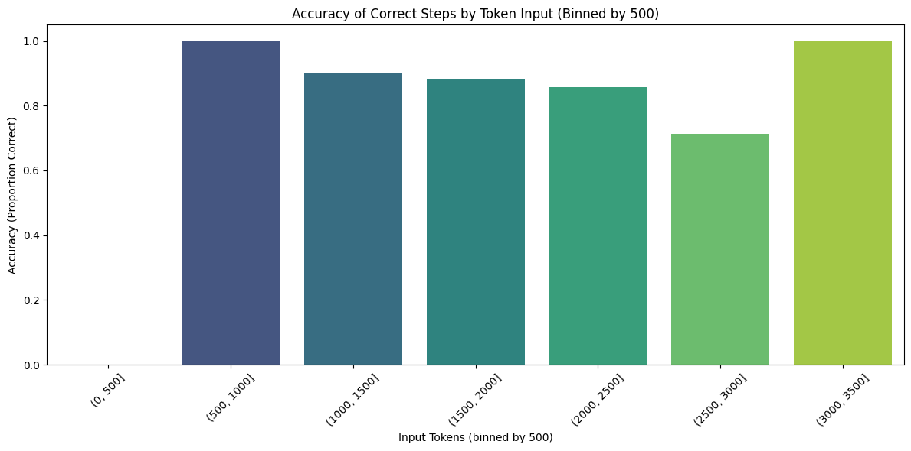
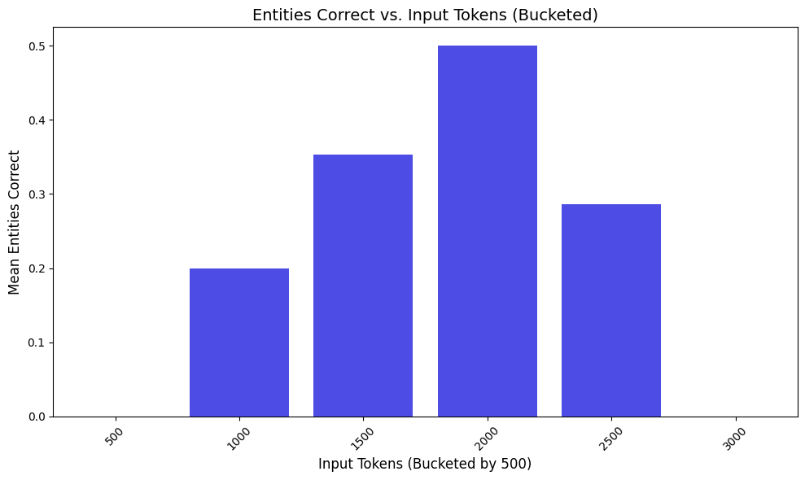
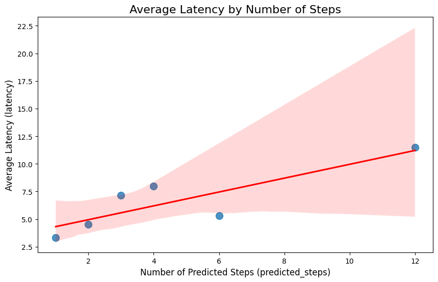

# Evaluating Somerville

To evaluate the efficacy of Somerville as a solution, 50 responses were obtained over a randomized set of records from the ConFinQA dataset.  
The core accuracy metrics assessed here include:  
- **Overall accuracy of responses**  
- **Accuracy of step number** (i.e., has the LLM predicted the correct number of operations?)  
- **Accuracy of entities extracted** (i.e., has the LLM extracted the correct numbers to use?)  

In addition to these core metrics, a number of other factors were analyzed to understand the relationship between the complexity of questions and the LLM's performance:  
- Input token length  
- Latency  

## **Assumptions**

A number of assumptions should be clarified for this evaluation:
- Somerville used GPT-4o for all LLM calls.
- A 'correct' answer was assumed to be equal to the true answer, rounded to 3 significant figures. This accounts for overly long floats arising form division and also is a reasonable formatting choice if these results were to be used in a real production application.
- Unless otherwise stated, all results were obtained from a substet of 50 questions from a pre-processed version of the ConvFinQA dataset containing 3026 question-context records, which can be found at:

    `src/data/ConvFincQA_data.json`  

- Full test results can be found here:

    `ConvFinQA_test_subset_50_results.json`    
---

## **Overall Accuracy**

Across the 50 responses:
- Somerville achieved an **accuracy of 72%**, assuming responses and true answers were rounded to three decimal places.  
- The **accuracy of predicted steps versus the true number of steps** was **86%**, indicating that the LLM was able to approximate the correct number of operations required for the mathematical tasks in most cases.  
- The **accuracy of entity extraction** was significantly lower, at **34%**.  

This lower entity extraction accuracy indicates two key points:  
1. The LLM often fails to extract the correct arguments for answering a given question.  
2. However, the LLM can still arrive at a correct answer despite inaccuracies in extracting entities.  

A primary reason why overall accuracy remains high while entity extraction accuracy is low is the assumption that **rounding to three significant figures** is reasonable for comparing predicted and true answers. With this assumption, a minor extraction error (e.g., rounding) can still produce an answer close enough to the true value to be considered correct. For example:  

- LLM's extracted entities: `[62, 40, 0, 40]`  
- True entities: `[62.1, 40.13, 0, 40.13]`  
- LLM's answer: `0.547471`  
- True answer: `0.54747`  

This behavior could likely be improved with more accurate prompting. One possible issue is that the LLM rounds input values to integers rather than preserving decimal values (floats).  

---

## **Accuracy of Predicted Steps**

The LLM demonstrated solid performance in predicting the correct number of steps required to solve the questions. For example:  

- The **average number of true steps** required to solve the questions was **2.22**, compared to the **average predicted steps** of **2.46**.  

This suggests the LLM generally performs well when creating operation workflows, neither underestimating nor overestimating the number of steps by a significant margin. This is reflected in the **step accuracy metric of 86%**.  

However, this evaluation has limitations: the majority of questions in the sample required either 2 or 3 steps, with few outliers. Future testing with a broader range of step counts is required for a more conclusive assessment.

---

## **Answer Accuracy by Predicted Steps**

Similar to in the paper attached to this datset, *[CONVFINQA: Exploring the Chain of Numerical Reasoning in Conversational Finance Question Answering](https://arxiv.org/pdf/2210.03849)*, it is worth investigating how the number of steps required to execute impacts the accuracy of the solution.

Somerville seems to not suffer from the similar drop off in performance with increase in steps when evaluated on a seperate dataset containing 40 rows, with 10 rows for operations with 2, 3, 4 and 5 steps.

It is possible with the improvment in cognitive power that GPT-4o offers, the number of steps requires is not the limiting factor, rather whether the LLM can accurately extract entities.

---

## **Answer Accuracy by Volume of Input Tokens**

It is reasonable to hypothesize that answer accuracy may be impacted by the size of the input provided to the LLM. For instance, larger inputs might result in lower accuracy due to the higher volume of information the LLM must process, potentially leading to less accurate entity extraction or an incorrect order of operations.  

A histogram of the token input lengths for this test is shown below:  

### **Observations**:
- **Answer Accuracy by Input Tokens**: Answer accuracy appears to be generally unaffected by input token length. The accuracy fluctuates around the overall mean of **72%** for most token ranges (1,000–2,500 tokens). Outliers exist at the **500** and **3,000+ token buckets**.  

### **Step Accuracy by Input Tokens**:  
Step accuracy decreases as input length increases, with an exception in the **3,000–3,500 token range** (likely an outlier). This suggests that longer input contexts may introduce challenges for accurate operation sequencing:  

  

### **Entity Extraction Accuracy by Input Tokens**:  
Entity extraction accuracy shows an interesting pattern, with a "sweet spot" around **2,000 tokens**, showing double the accuracy of the ranges at both **1,000 tokens** and **2,500 tokens**. However, this could be due to imbalanced sampling:  

  

---

## **Latency**

Although not a critical metric during this prototype phase, latency is an important factor for production use. As expected, **latency generally increased with the number of predicted steps**, with an **average latency of 5.1 seconds** across 50 responses:  

  

An average latency of 5.1 seconds is reasonable for conversational AI. However, factors such as cloud resource availability or Responsible AI (RAI) checks could add additional latency in a production environment.  

**Potential Optimization for Latency**:
- While removing the second entity extraction step could significantly reduce latency, it would compromise the observability of arguments extracted by the LLM.  

---

## **Overall Solution Evaluation**

In the original paper accompanying the ConFinQA GitHub repository, *[CONVFINQA: Exploring the Chain of Numerical Reasoning in Conversational Finance Question Answering](https://arxiv.org/pdf/2210.03849)*, the authors achieved **40.63% accuracy** across the dataset using chain-of-thought (CoT) prompting with GPT-3.  

In contrast, **Somerville achieved 72% accuracy** over a subset of test questions.  
- Somerville differs by utilizing **chained LLM calls** instead of one-shot CoT prompting, while also leveraging the far more capable GPT-4 model.  

For a fairer comparison, Somerville's performance can be evaluated against the top scores from the [CodaLab leaderboard for ConFinQA](https://codalab.lisn.upsaclay.fr/competitions/8582), where the leading solution achieves **80.80% accuracy**.  

### **Strengths of Somerville**
- **Observability**: Chained prompting allows visibility into the LLM's assumptions, arguments, and logic.  
- **Accuracy**: A solid 72% accuracy demonstrates the strength of GPT-4 compared to older models like GPT-3.  
- **Latency**: With average latency of 5.1 seconds, Somerville is fast enough for most conversational AI use cases.  
- **Microservice Architecture**: Designed as an API, Somerville is flexible and deployable across diverse cloud environments.  
- **Scalability**: The architecture supports multiple agents and a homebrewed data model, making Somerville adaptable to other agent-based tasks or datasets.  

### **Limitations of Somerville**
- **High Token Consumption**: The use of two API calls per input, each with full context and example outputs, results in high token consumption, leading to higher costs and potential service outages if token per minute (TPM) limits are exceeded.  
- **Request Overhead**: Doubling the internal API requests (compared to one-shot CoT methods) may breach request per minute (RPM) quotas.  
- **Moderate Latency**: Although acceptable, an average latency of 5.1 seconds may increase by 50%–75% in a production environment with added security layers.  
- **Dependency on APIs**: Leveraging API-accessed models like GPT-4 rather than open-source LLMs increases reliance on external cloud services and associated costs.  

---

## **Closing Thoughts**

Performing arithmetic with LLMs is challenging. In production use cases, the inability of LLMs to perform simple calculations often results in poor user experiences. However, this prototype demonstrates that:  

1. LLMs, with careful prompting, can handle arithmetic tasks fairly well.  
2. Higher accuracy for complex tasks can be achieved through multi-stage processes, such as the chaining approach used in Somerville.  

Overall, this project was an insightful challenge, and I thoroughly enjoyed working on it.  